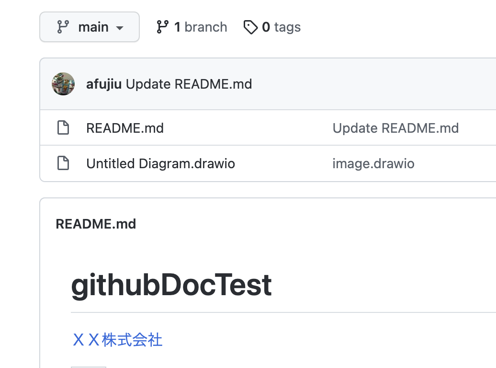

# githubDocTest
<a href="/">ＸＸ株式会社</a>

<table>
  <tr><th>a</th></tr>
  <tr><td>a</td></tr>
</table>

# 画像


# SVG


```mermaid
sequenceDiagram
  ユーザ    ->> +Vue.js         : ログインボタンクリック
  Vue      ->> +Laravel     : ログインAPI
  Laravel  ->> +Database    : SQL
    Note right of Database  : 認証テーブル参照
  Database ->> -Laravel     : Result
  alt ログイン成功
    Laravel ->> Vue.js         : success
  else 失敗
    Laravel ->> -Vue.js        : failure
  end
  Vue.js       ->> -ユーザ      : 結果表示
  ```
